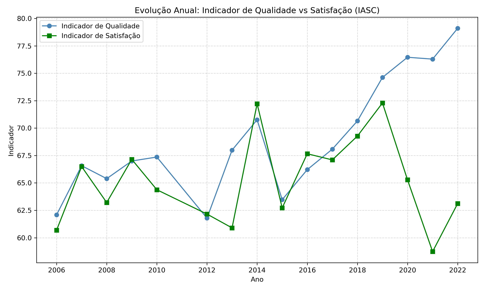
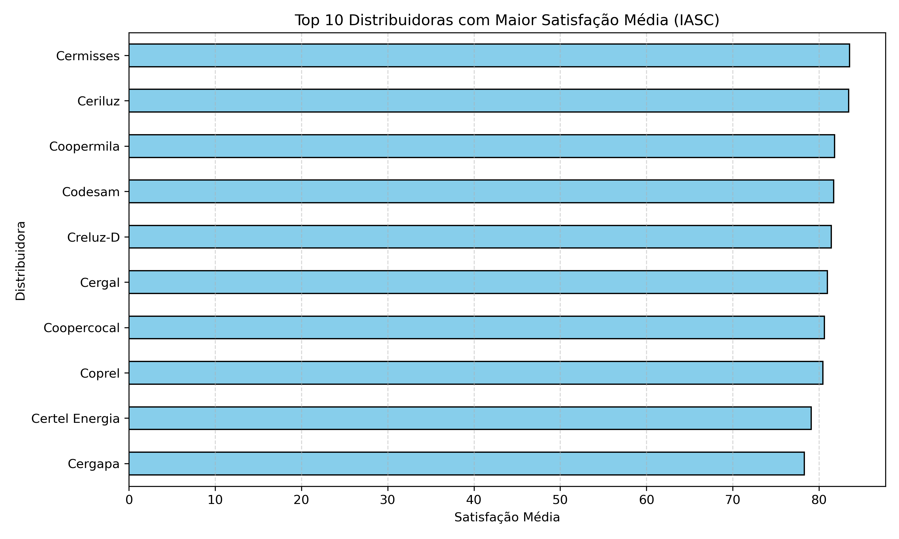
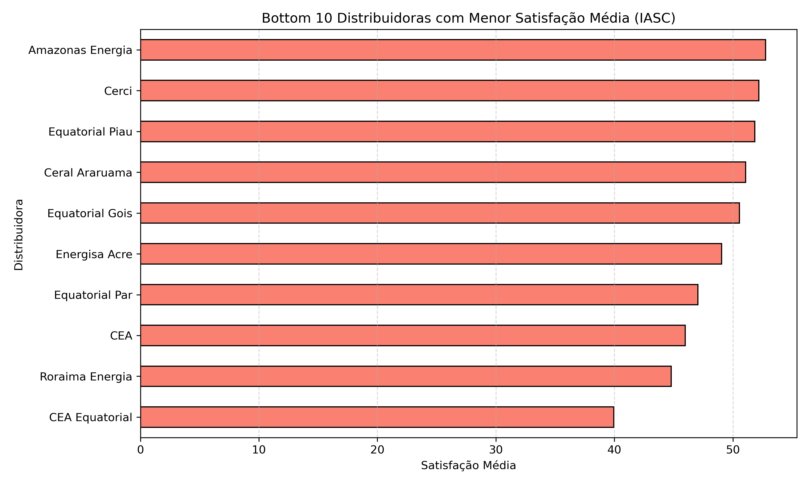

# 📊 Análise do Índice ANEEL de Satisfação do Consumidor (IASC) no Setor Elétrico

Este projeto tem como objetivo **analisar dados do Índice ANEEL de Satisfação do Consumidor (IASC)**, explorando a relação entre **indicadores de qualidade técnica e satisfação percebida pelos consumidores** no setor de distribuição de energia elétrica no Brasil.

---

## 🎯 **Objetivos**

✅ Avaliar a evolução dos indicadores de qualidade e satisfação ao longo do tempo.  
✅ Identificar as distribuidoras com **melhores e piores desempenhos em satisfação**.  
✅ Explorar a correlação entre qualidade técnica e satisfação.  
✅ Criar **gráficos e insights claros para tomada de decisão e aprendizado setorial**.

---

## 🔍 **Sobre o IASC**

O **IASC é calculado anualmente pela ANEEL** e mede a percepção do consumidor sobre os serviços prestados pelas distribuidoras de energia elétrica. Ele é uma referência para o setor e utilizado para avaliar o relacionamento entre distribuidoras e consumidores.

---

## 🛠️ **Etapas realizadas**

1️⃣ **Importação e limpeza de dados.**  
2️⃣ **Conversão e tratamento de colunas numéricas.**  
3️⃣ **Geração de gráficos de evolução ao longo dos anos:**  
   - Média de qualidade por ano.  
   - Média de satisfação por ano.  
   - Gráfico comparativo de linhas (Qualidade x Satisfação).  
4️⃣ **Geração de rankings:**  
   - Top 10 distribuidoras em satisfação média.  
   - Bottom 10 distribuidoras em satisfação média.  
5️⃣ **Geração de insights e storytelling para compreensão setorial.**

---

## 📈 **Principais Gráficos**

### 📊 Evolução Anual: Indicador de Qualidade vs Satisfação

Observa-se uma tendência de **crescimento gradual na satisfação média ao longo dos anos**, acompanhada pela evolução do indicador de qualidade técnica das distribuidoras.

---

### 🥇 Top 10 Distribuidoras em Satisfação

As distribuidoras que aparecem no topo demonstram **práticas consistentes de relacionamento com o consumidor**, sendo referências no setor.

---

### 🥉 Bottom 10 Distribuidoras em Satisfação

As distribuidoras com menor satisfação média indicam desafios regionais ou estruturais, sendo pontos de atenção para melhorias na experiência do consumidor.

---

## 💡 **Principais Insights**

✅ **Satisfação e qualidade técnica estão correlacionadas, mas não são idênticas:**
   - Algumas distribuidoras possuem alta qualidade técnica e baixa satisfação, indicando oportunidades de melhorar comunicação e relacionamento.
   - Outras possuem satisfação alta mesmo com qualidade mediana, reforçando a importância da experiência do consumidor.

✅ **Variações regionais podem impactar a percepção:**
   - Distribuidoras em áreas remotas ou com dificuldades logísticas tendem a enfrentar mais desafios, refletindo nos índices de satisfação.

✅ **Benchmarking pode ser feito a partir das líderes em satisfação, estudando práticas de atendimento, comunicação e eficiência operacional.**

---

## 🚀 **Próximos Passos**

🔹 Analisar **a variação ao longo dos anos por distribuidora específica.**  
🔹 Cruzar o IASC com indicadores de continuidade (DEC/FEC) para análises integradas.  
🔹 Desenvolver dashboards interativos no Power BI ou Plotly para visualização dinâmica.

---

## 🧑‍💻 **Sobre o Autor**

Este projeto faz parte do meu **portfólio de Análise de Dados no Setor Elétrico**, com foco em **criar estudos aplicados, limpos e úteis para tomada de decisão e aprendizado regulatório**.

**Diego Juliano Lima**  
Analista de Dados e Processos | Estudante de Python e Regulação no Setor Elétrico

---

## 🤝 **Contribuições**

Sugestões e colaborações são bem-vindas para expandir este estudo e contribuir com o aprendizado do setor.

---

## 📂 **Dados**

Os dados utilizados são públicos e foram extraídos do site da [ANEEL](https://www.gov.br/aneel/pt-br).

---

## 📧 **Contato**

Conecte-se no [LinkedIn](https://www.linkedin.com) para trocarmos ideias sobre dados e o setor elétrico.

---

